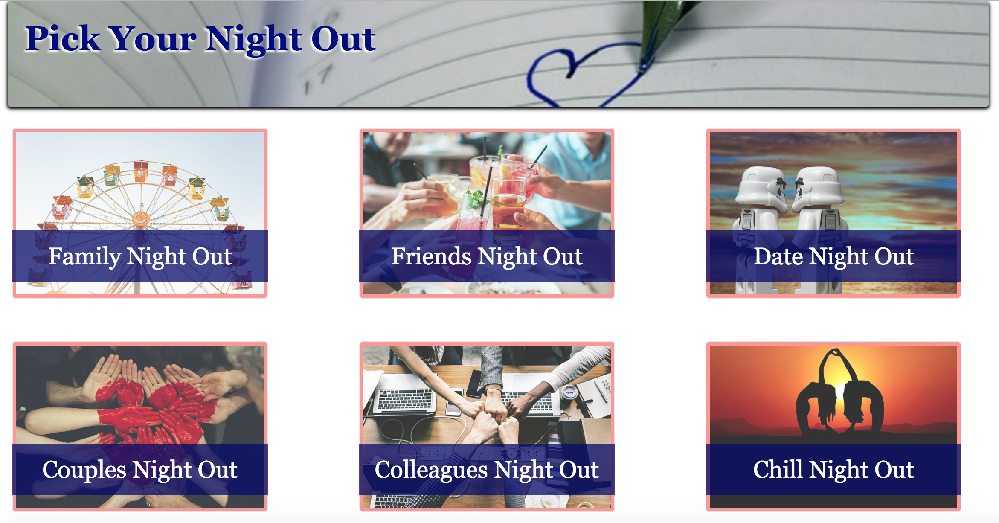

# NightOutRoulette

Night Out Roulette will allow the user to select from a list of categories -
1. Family Night Out
2. Date Night
3. Colleagues Night Out
4. Quiet Night Out
5. Friends Night Out
6. Couples Night Out

After selecting a night out, the user will asked to enter a city and state for location.  
Then they will have spin the wheel. 
Upon clicking on spin, an option will be randomly selected. 
Once the option is selected, we will display a list of locations for the users to go.

Potentional additions:
1. Add Lyft API pricing and time to get to location
2. Add Fandango API for list of movie showings

